# CTE Abnormal Security v1.0.0 Readme 
  
## Release Notes
### 1.0.0
#### Added
- Initial Release.
- This plugin is used to fetch the indicators of type SHA256, MD5, URL, Domain and IPv4 from the Abnormal Security platform. This plugin does not support sharing of indicators to Abnormal Security platform.

## Description
This plugin is used to fetch the indicators of type SHA256, MD5, URL,
Domain and IPv4 from the Abnormal Security platform. This plugin does
not support sharing of indicators to Abnormal Security.

## Prerequisites

-   Netskope Tenant (or multiple, for example, production and development/test instances)

-   Netskope Cloud Exchange: Threat Exchange module

-   Abnormal Security platform credentials

## CE Version Compatibility 

-   Netskope CE v5.1.0 and v5.1.1

## Plugin Scope

  | Type of data supported| Description |
|----------|----------|
| Fetched indicator types| SHA256, MD5, URL, Domain and IPv4 |
| Shared indicator types|  Not Supported |


## Connectivity to the following hosts

-   The plugin needs a connection with any one of the following Abnormal Security Instances:

    -   Production Server ([api.abnormalplatform.com](api.abnormalplatform.com))

    -   EU Production Server ([eu.rest.abnormalsecurity.com](eu.rest.abnormalsecurity.com))


## Mappings

### Pull Mapping

| Netskope CE Fields | Abnormal Security Fields |
|----------|----------|
| value | value corresponding to field(senderDomain or senderIpAddress or md5 or sha256 or urls or url) |
| type | senderDomain, senderIpAddress, md5, sha256, urls, url |
| firstSeen | receivedTime(for senderDomain and senderIpAddress and urls) or createdOn(for md5 and sha256 and url) |
| lastSeen | receivedTime(for senderDomain and senderIpAddress and urls) or lastUpdated(for md5 and sha256 and url) |
| tags | summaryInsights, remediationStatus |
| comments | subject |

**Note:**

The urls field extracted from threat details api response is the list of URLs found in email body. The url field extracted from message attachment api response is the list of URLs found in email attachment.

## API Details

### List of APIs Used
| API Endpoint  | Method | Use Case |
|----------|----------|----------|
| /threats | GET | Get all threats within given timerange, paginated |
| /threats/<threat_id> | GET | Get threat details of given threat |
| /messages/<message_id>/attachment/<attachemnt_name> | GET | Get message and attachment details, message_id and attachment_name taken from above Threat details endpoint |

### Pull Threats

**Endpoint:** /threats

**Method:** GET

**Headers:**

  | Key | Value |
|----------|----------|
| User-Agent | netskope-ce-cte-abnormal-security-v1.0.0 |
| Accept |  application/json |
| Content-Type |  application/json |
| Authorization | Bearer token |

**Params:**

  | Key | Value |
|----------|----------|
| pageSize | 100 |
| pageNumber |  100 |
| filter | receivedTime gte <start_time> lte <end_time> |

**Sample Response**

```json
{
  "threats": [
    {
      "threatId": "184712ab-6d8b-47b3-89d3-a314efef79e2"
    }
  ],
  "pageNumber": 1,
  "nextPageNumber": 2
}
```


### Pull Threat details

**Endpoint:** /threats/\<threat_id\>

**Method:** GET

**Headers:**

  | Key | Value |
|----------|----------|
| User-Agent | netskope-ce-cte-abnormal-security-v1.0.0 |
| Accept |  application/json |
| Content-Type |  application/json |
| Authorization | Bearer token |

**Params:**

  | Key | Value |
|----------|----------|
| pageSize | 100 |
| pageNumber |  100 |

**Sample Response**

```json
{
  "threatId": "184712ab-6d8b-47b3-89d3-a314efef79e2",
  "messages": [
    {
      "threatId": "184712ab-6d8b-47b3-89d3-a314efef79e2",
      "abxMessageIdStr": "4551618356913732000",
      "abxPortalUrl": "https://portal.abnormalsecurity.com/home/threat-center/remediation-history/4551618356913732076",
      "subject": "Phishing Email",
      "fromAddress": "support@secure-reply.org",
      "fromName": "Support",
      "senderDomain": "secure-reply.org",
      "toAddresses": "example@example.com, another@example.com",
      "recipientAddress": "example@example.com",
      "receivedTime": "2020-06-09T17:42:59Z",
      "sentTime": "2020-06-09T17:42:59Z",
      "internetMessageId": "<5edfca1c.1c69fb81.4b055.8fd5@mx.google.com>",
      "remediationStatus": "Auto Remediated",
      "attackType": "Extortion",
      "attackStrategy": "Name Impersonation",
      "returnPath": "support@secure-reply.org",
      "replyToEmails": [
        "reply-to@example.com"
      ],
      "ccEmails": [
        "cc@example.com"
      ],
      "senderIpAddress": "100.101.102.103",
      "impersonatedParty": "None / Others",
      "attackVector": "Text",
      "attachmentNames": [
        "attachment.pdf"
      ],
      "attachmentCount": 0,
      "urls": [
        "https://www.google.com/"
      ],
      "urlCount": 0,
      "summaryInsights": [
        "Bitcoin Topics",
        "Personal Information Theft",
        "Unusual Sender"
      ],
      "remediationTimestamp": "2020-06-09T17:42:59Z",
      "isRead": true,
      "attackedParty": "VIP",
      "autoRemediated": "True",
      "postRemediated": "False"
    }
  ],
  "pageNumber": 1,
  "nextPageNumber": 2
}
```

### Pull Threat Message and Attachment details

**Endpoint:** /messages/\<message_id\>/attachment/\<attachment_name\>

**Method:** GET

**Headers:**

  | Key | Value |
|----------|----------|
| User-Agent | netskope-ce-cte-abnormal-security-v1.0.0 |
| Accept |  application/json |
| Content-Type |  application/json |
| Authorization | Bearer token |

**Params:**

  | Key | Value |
|----------|----------|
| NA | NA |

**Sample Response**

```json
{
  "attachmentName": "string",
  "type": "JPEG",
  "details": [
    "has Javascript"
  ],
  "md5": "20d7c4ff776f51af2e87c7271d4af628",
  "sha1": "bbefe473c9c432fee20f5bc67fb1968341cbbd93",
  "sha256": "string",
  "size": "string",
  "createdOn": "2020-06-09T17:42:59Z",
  "lastUpdated": "2020-06-09T17:42:59Z",
  "url": [
    "http://malicious.lamronba.com"
  ],
  "keyPhrases": [
    "view",
    "completed document"
  ]
}

```
## User Agent
- netskope-ce-cte-abnormal-security-v1.0.0

## Workflow

- Get API Token

- Configure the Netskope Tenant

- Configure the Netskope CTE plugin

- Configure the Abnormal Security plugin

- Add Business Rule

- Add Sharing

- Validation

## Configuration on Abnormal Security

To get the API Token, follow the steps mentioned in the documentation
available on Abnormal Security's website. Link for the documentation is
as follows:

[https://abnormalsecurity.my.site.com/knowledgebase/s/article/Abnormal-REST-API-Integration](https://abnormalsecurity.my.site.com/knowledgebase/s/article/Abnormal-REST-API-Integration)

## Configuration on Netskope Tenant

Follow the steps provided in the below document to configure the
Netskope Tenant:

[https://docs.netskope.com/en/netskope-tenant-plugin/](https://docs.netskope.com/en/netskope-tenant-plugin/)

Follow the steps provided in the below document to configure the
Netskope plugin on Netskope CE

[https://docs.netskope.com/en/threat-exchange-v2-1-0-plugin/](https://docs.netskope.com/en/threat-exchange-v2-1-0-plugin/)

## Configuration on Netskope CE

### Abnormal Security Plugin configuration

1.  Login to your Netskope CE and navigate to Settings \> Plugins. Search for the Abnormal Security plugin and click on the plugin box to configure the plugin.

 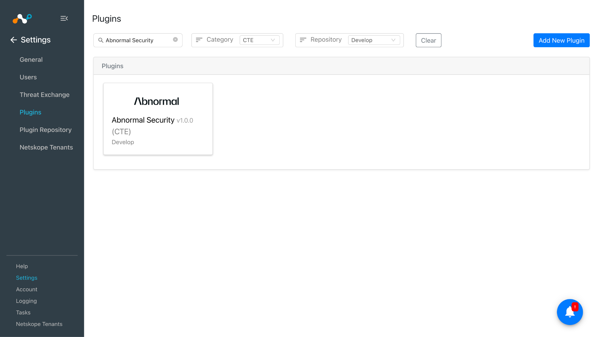

2.  Fill the details in the following fields:

    -   **Configuration Name**: Unique name for the configuration

    -   **Sync Interval**: Leave default

    -   **Aging Criteria:** Expiry time of the plugin in days. ( Default: 90 )

    -   **Override Reputation**: Set a value to override the reputation of indicators received from this configuration. ( Default: 5 )

    -   **Enable SSL Validation**: Enable SSL Certificate validation.

    -   **Use System Proxy**: Enable if the proxy is required for communication

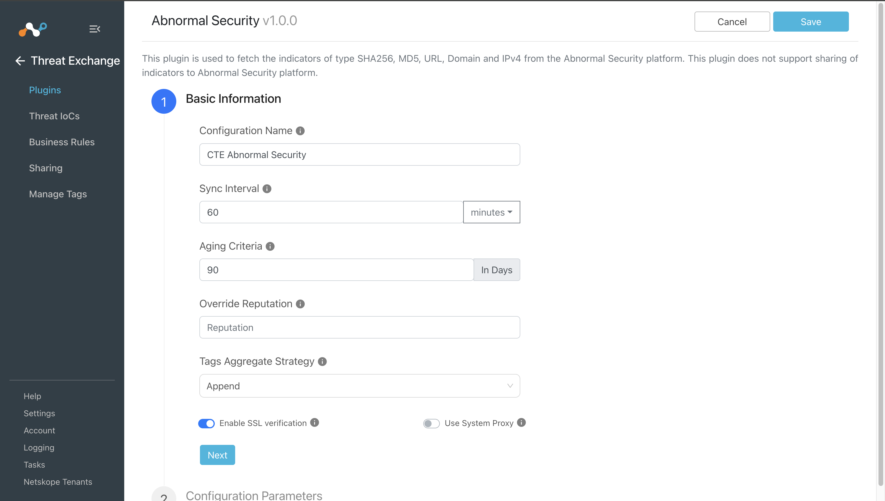

3.  Click on Next and provide the below details.

    -   **Base URL:** Base URL of Abnormal Security API endpoint.

    -   **API Token:** Provide the API Token from Settings \> Integrations \> Abnormal REST API.

    -   **Type of Threat Data to Pull:** Type of Threat data to pull. Allowed values are SHA256, MD5, URL, Domain and IPv4.

    -   **Retraction Interval (in days):** Retraction Interval days to run IoC(s) retraction for Abnormal Security indicators. Note:
 This parameter will only be considered if IoC(s) Retraction is enabled in Threat Exchange Settings. This parameter is applicable only for Netskope CE version 5.1.0 and above.

    -   **Enable Tagging:** Enable/Disable tagging functionality.

    -   **Initial Range (in days):** Number of days Threat IoCs to pull in the initial run.

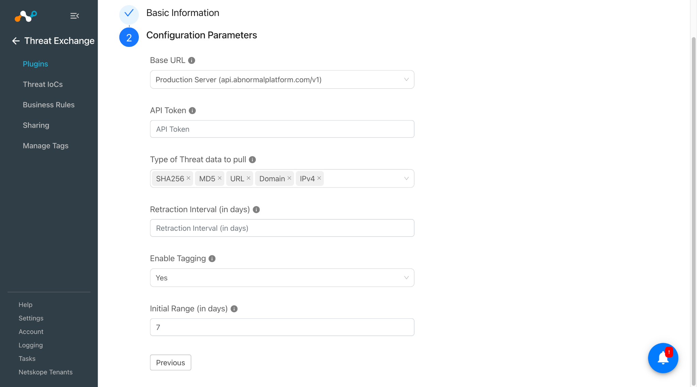

4. Click on Save.

## Add Business Rule

To share indicators fetched from the Vectra AI to the Netskope CE, you
will need to have a business rule that will filter out the indicators
that you want to share. To configure a business rule follow the below
steps:

1.  Go to Threat Exchange \> Business Rule \> Create New Rule.

2.  Add the filter according to your requirement in the rule and then click on Save.

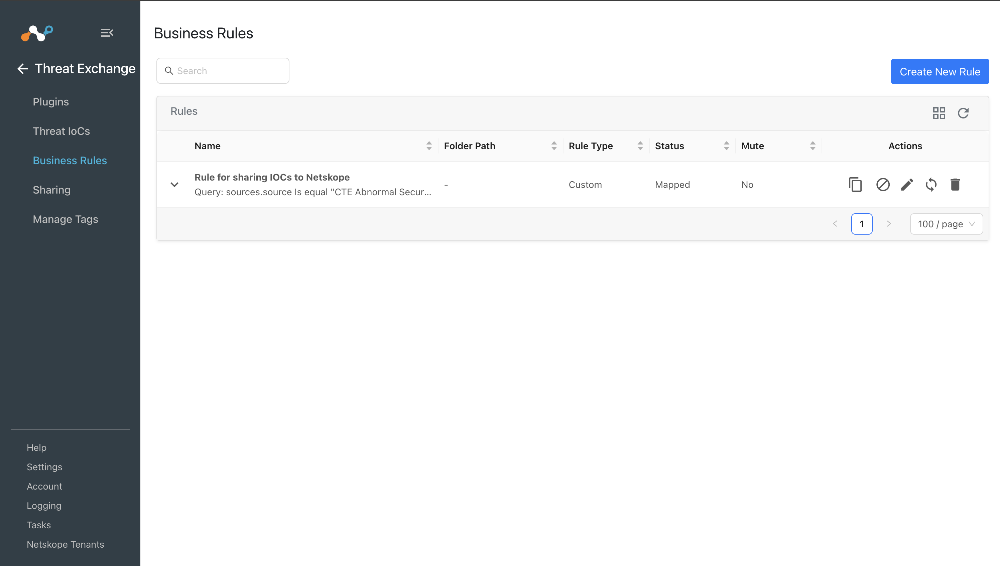

## Add Sharing

To share IOCs from the Abnormal Security to other third party platform,
follow the below steps:

1.  Go to Threat Exchange \> Sharing. Click on the Add Sharing Configuration button.

2.  Select your Source Configuration(CTE Abnormal Security), Business Rule, Destination Configuration(CTE Netskope), and Target.

3.  Click on Save.

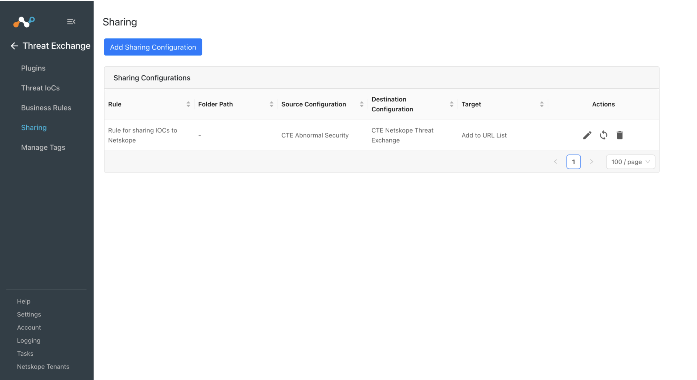

#### Note:  
Abnormal Security plugin does not support sharing of IOCs but the IOCs pulled from this plugin can be shared to other third party platforms.

## Validation

### Validate the Pull

To verify pulled logs on CE go to Logging and search logs from the CTE
Abnormal Security plugin. You can filter the logs using the *filter:*
message Like \"\[\<plugin configuration name\>\]\"

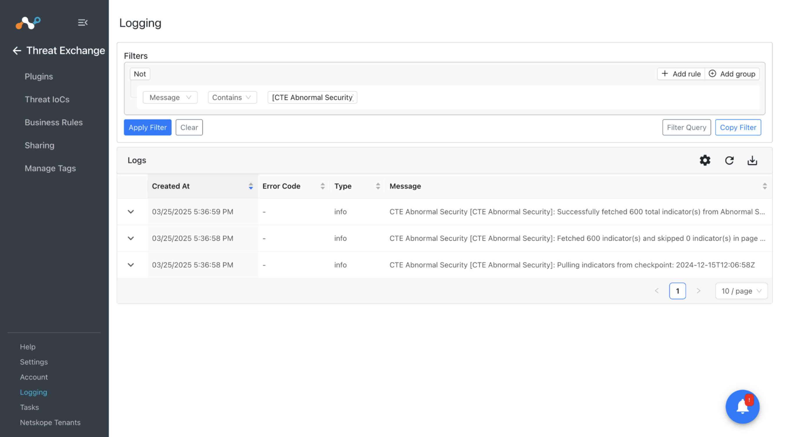

Pulled data will be listed on the Threat IOCs page. You can filter the
IOCs pulled from the platform using the *filter:* sources.source Like
\"\<plugin configuration name\>\"

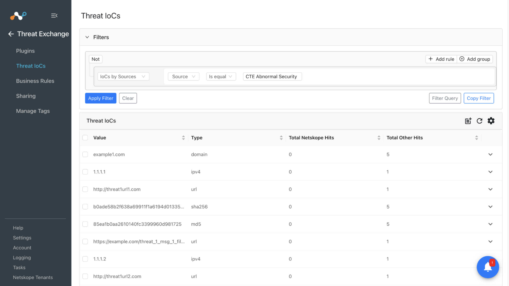

### Validate the Retraction

To verify pulled logs on CE go to Logging and search logs from the CTE
Abnormal Security plugin. You can filter the logs using the *filter:*
message Like \"\[\<plugin configuration name\>\] [Retraction]\"

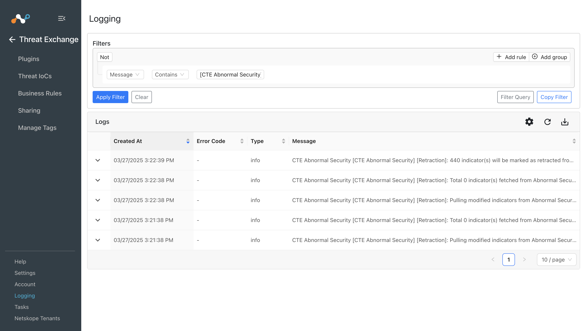

We can validate the retracted IOCs on the Threat IOCs page:
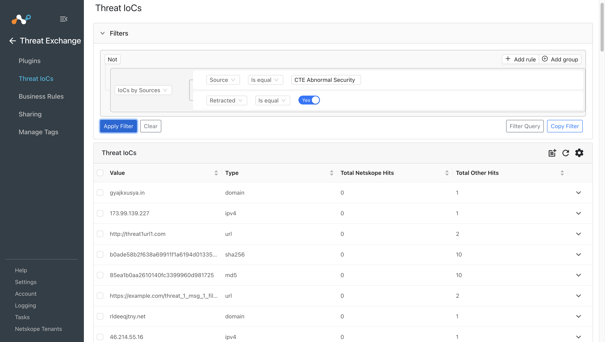

#### Note: 
Retraction will only work for Active indicators, the Inactive indicators will not be marked as retracted in CE.

This plugin does not support sharing of IOCs to the Abnormal Security platform but the IOCs pulled from Abnormal Security plugin can be shared to other third party platforms. When the IOCs shared from ThreatQ to Third Party are deleted from that platform then it will be marked as “<plugin-config-name>: retracted” in the Retraction Result. If they are not deleted from the Third party the Retraction Result will be pending else it will be retracted.
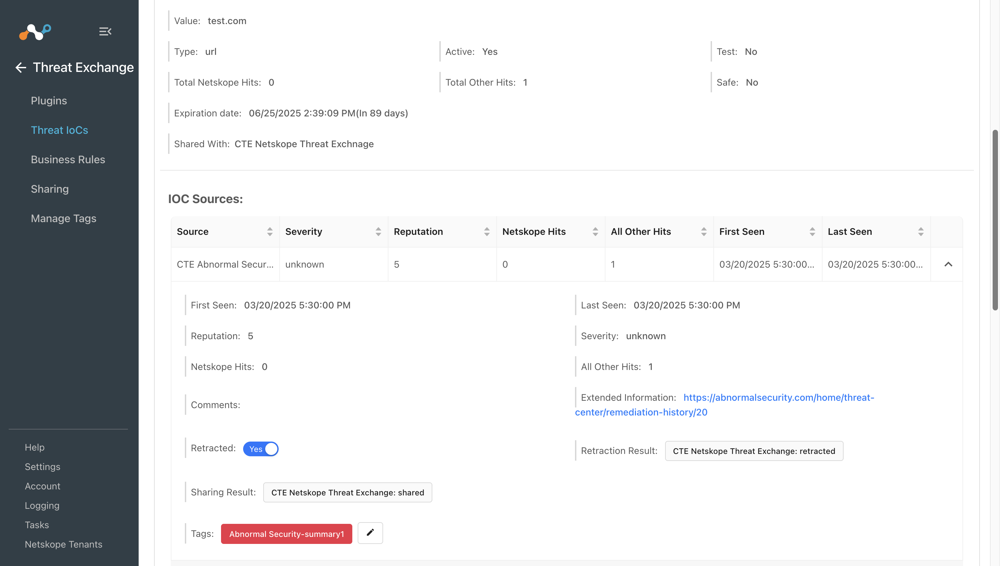

IOCs pulled from Abnormal Security were shared to a URL list “CTE Demo” on the Netskope Tenant.
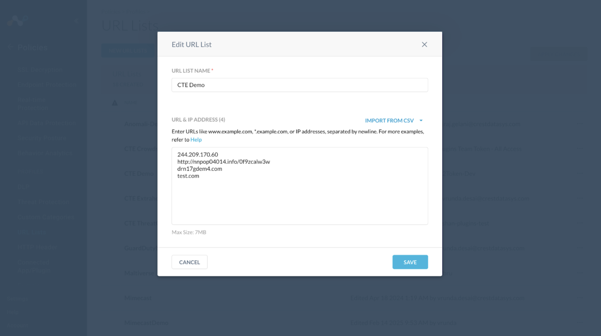

If any of the shared IOCs are marked as retracted in CE, it would be deleted from the Netskope tenant as well. Here, you can see the IOCs which were marked Retracted “Yes” in the retraction screenshot, were also deleted from the URL list on the Netskope tenant.

