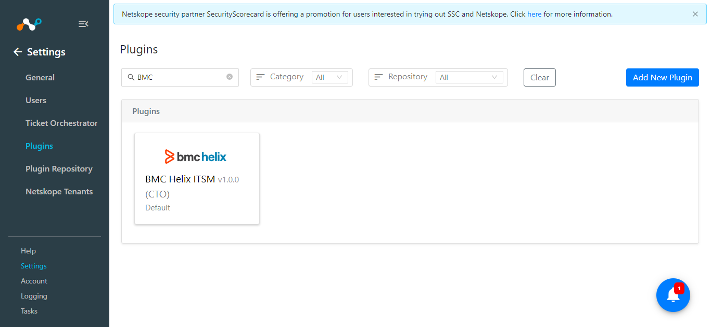
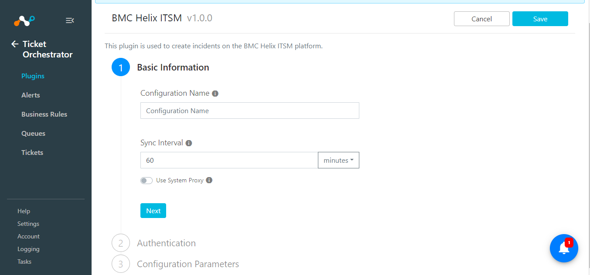
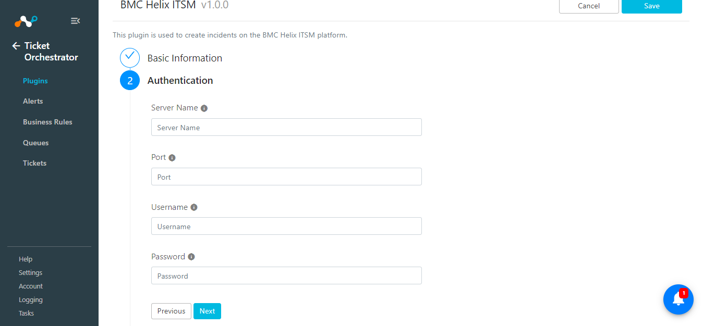
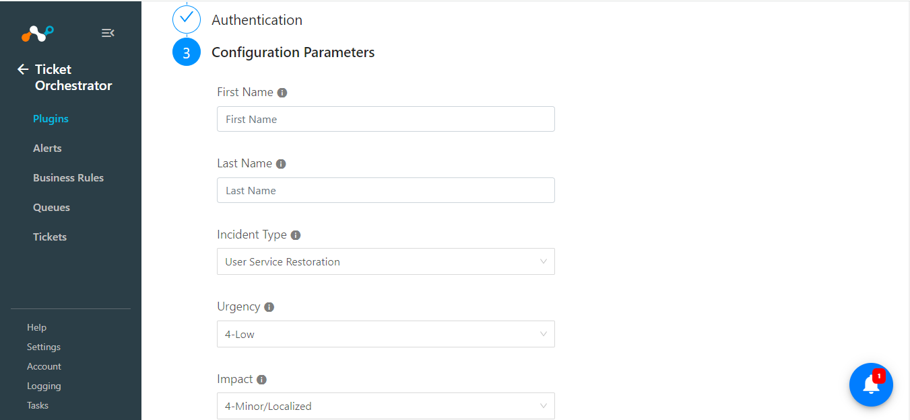
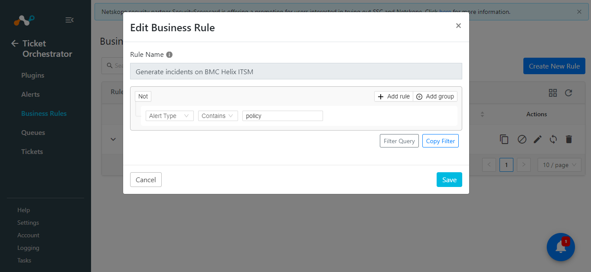

# CTO BMC Helix ITSM v1.0.0 Readme

## Release Notes
### 1.0.0
#### Added

- Initial Release.
- BMC Helix ITSM Plugin used to create incident on the BMC Helix ITSM platform.
  
## Description

This plugin is used to create incidents on the BMC Helix ITSM platform.

## Plugin Scope

| Type of data supported        |    |                                     
|-------------------------------|------------------------------------------------------|
| Supported Alert types for generating incidents       |Anomaly, Compromised Credentials, Policy, Legal Hold, Malsite, Malware, DLP, Security Assessment, Watchlist, Quarantine, Remediation, UBA, CTEP                                                              |
| Create Tickets|Yes
|Sync Tickets|Yes

## Prerequisites

- Netskope Tenant (or multiple, for example, production and development/test instances)
- Netskope Cloud Exchange: Ticket Orchestor Module.
- BMC Helix ITSM On-Prem instance.


## Connectivity to the following hosts

- Connectivity to BMC Helix ITSM On-Prem instance.
  
## Mappings

### Status Mapping

|Netskope Ticket Status|BMC Helix Incident Status |
|--|--|
|new | New|
|in_progress | In Progress|
|on_hold  | Pending|
|closed  | Closed|

 **Note:** Any status other than the above from the BMC Helix ITSM platform will be considered as "Other" in Netskope CE.
 
## API Details

### List of APIs used

|API Endpoint  |Method  | Use case  |
|--|--|-- |
| /api/jwt/login | POST|  Generate Auth Token|
| /api/arsys/v1/entry/HPD:IncidentInterface_Create | POST | Create an incident |
|/api/arsys/v1/entry/HPD:IncidentInterface |GET  |  Get incident details|

**Note:** We utilizes the platform [REST API](https://docs.bmc.com/docs/itsm213/integrating-third-party-applications-with-bmc-helix-itsm-by-using-the-platform-rest-api-1030556750.html). This plugin only supports On-Prem solution.

### Get Auth Token

**Endpoint:** /api/jwt/login

**Method:** POST 

#### Headers

|  Key|Value  |
|--|--|
| User-Agent | netskope-ce-5.0.0-cto-bmc-helix-itsm-v1.0.0 |
| Content-Type | application/x-www-form-urlencoded |
|Accept | application/json |

#### Request Body

|**Parameter**  | **Value** |
|--|--|
| username | username |
| password | password |

#### Sample Response

```
eyJ0eXAiOiJKV1QiLA0KICJhbGciOiJIUzI1.*********************UiLA0KICJleHAiOjEzMDA4MTkzODAsDQogImh0dHA6Ly9leGFtcGxlLmNvbS9pc19yb290Ijp0cnVlfQ.dBjftJeZ4CVP-mB9
```

### Create an incident

**Endpoint:** /api/arsys/v1/entry/HPD:IncidentInterface_Create

**Method:** POST 

#### Headers

|  Key|Value  |
|--|--|
| User-Agent | netskope-ce-5.0.0-cto-bmc-helix-itsm-v1.0.0 |
| Content-Type | application/x-www-form-urlencoded |
|Accept | application/json |

#### Request Body

```
{
  "values": {
      "First_Name": "Allen",
      "Last_Name": "Allbrook",
      "Description": "REST API: Incident Creation",
      "Impact": "1-Extensive/Widespread",
      "Urgency": "1-Critical",
      "Status": "Assigned",
      "Reported Source": "Direct Input",
      "Service_Type": "User Service Restoration"    
 }
}
```


#### Sample Response

```
HTTP/1.1 201  Created
Content-Type: application/json

{
        "values": {
            "Incident Number": "INC000000395989",
            "Status": "New"
        },
        "_links": {
            "self": [
                {
                    "href": "https://****gh8xvgavx.env.cloudshare.com/api/arsys/v1.0/entry/HPD:IncidentInterface"
                }
            ]
        }
    }

```

### Get Incident Details

**Endpoint:**  /api/arsys/v1/entry/HPD:IncidentInterface

**Method:** GET

**Params:** q='Incident Number'="INC000000389350" 

#### Headers

|  Key|Value  |
|--|--|
| User-Agent | netskope-ce-5.0.0-cto-bmc-helix-itsm-v1.0.0 |
| Content-Type | application/x-www-form-urlencoded |
|Accept | application/json |

#### Sample Response:

```
 HTTP/1.1 200 OK
Content-Type: application/json

{
   "entries":[
      {
         "values":{
            "Request ID":"INC00000348|NC00000390348",
            "Submitter":"crest_admin3",
            "Submit Date":"2024-03-01T08:23:49.000+0000",
            "Assignee Login ID":"Mary",
            "Last Modified By":"Remedy Application Service",
            "Last Modified Date":"2024-03-01T08:23:50.000+0000",
            "Status":"Assigned",
            "Status-History":{
               "New":{
                  "user":"crest_admin3",
                  "timestamp":"2024-03-01T08:23:50.000+0000"
               },
               "Assigned":{
                  "user":"crest_admin3",
                  "timestamp":"2024-03-01T08:23:50.000+0000"
               }
            },
            "Assignee Groups":"1000000023;1000000005;",
            "InstanceId":"AGGAA5V0BUBEYASJNTZPSINHP4R2J4",
            "Vendor Assignee Groups":null,
            "Vendor Assignee Groups_parent":null,
            "Assignee Groups_parent":"",
            "Product Categorization Tier 1":null,
            "Product Categorization Tier 2":null,
            "Product Categorization Tier 3":null,
            "Department":null,
            "Site Group":null,
            "Region":null,
            "Product Name":null,
            "Manufacturer":null,
            "Product Model/Version":null,
            "Site":null,   
            "InfrastructureEventType":"Event",
            "policy_type":null,
            "Chat Session ID":null,
            "Modified Chat Session ID":null,
            "Auto Open Session":null,
            "TimeOfEvent":"2024-03-01T08:23:49.000+0000",
            "FirstWIPDate":null,
            "LastWIPDate":null,
            "Broker Vendor Name":null,
            "Description":"Test Service Type",
            "Company":"Calbro Services",
            "Country":null,
            "State Province":null,
            "City":null,
            "Organization":null,
            "Assigned Support Organization":"IT Support",
            "Last Name":"Jain",
            "First Name":"Anish",
            "Middle Initial":null,
            "Contact Client Type":"Customer",
            "VIP":"No",
            "Contact Sensitivity":"Standard",
            "Desk Location":null,
            "Mail Station":null,
            "Street":null,
            "Zip/Postal Code":null,
            "Internet E-mail":null,
            "Phone Number":"###",
            "z1D Char01":null,
            "Categorization Tier 1":null,
            "Categorization Tier 2":null,
            "Categorization Tier 3":null,
            "z1D Char02":null,
            "Site ID":null,
            "z1D Action":null,
            "Assigned Group ID":"SGP000000000011",
            "Person ID":"PPL000000000023",
            "Contact Company":"Calbro Services",
            "Service Type":"Infrastructure Event",
            "Status_Reason":null,
            "Detailed Decription":null,
            "Resolution":null,
            "Incident Number":"INC000000397049",
            "Urgency":"3-Medium",
            "Impact":"4-Minor/Localized",
            "Priority":"Medium",
            "Priority Weight":10,
            "Reported Source":"Email",
            "Assigned Group":"Service Desk",
            "Assignee":"Mary Mann",
            "Assigned Support Company":"Calbro Services",
            "Assigned Group Shift Name":null,
            "Assigned Group Shift ID":null,
            "Owner Support Organization":"IT Support",
            "Number of Attachments":null,
            "Vendor Name":null,
            "Owner Group":"Backoffice Support",
            "Owner Support Company":"Crest Data Systems",
            "Owner Group ID":"SGP000000000015",
            "Reported Date":"2024-03-01T08:23:49.000+0000",
            "Responded Date":null,
            "Last Acknowledged Date":null,
            "Last Resolved Date":null,
            "Closed Date":null,
            "Vendor Ticket Number":null,
            "z1D Permission Group ID":null,
            "z1D Permission Group List":null,
            "Resolution Category":null,
            "Direct Contact Internet E-mail":null,
            "Vendor Organization":null,
            "Vendor Group":null,
            "Vendor Group ID":null,
            "Total Transfers":1,
            "Resolution Method":null,
            "Resolution Category Tier 2":null,
            "Resolution Category Tier 3":null,     
            "Direct Contact Person ID":null,
         },
         "_links":{
            "self":[
               {
                  "href":"https://****8xvgavx.env.cloudshare.com/api/arsys/v1.0/entry/HPD:IncidentInterface/INC000000390348%7CINC000000390348"
               }
            ]
         }
      }
   ],
   "_links":{
      "self":[
         {
            "href":"https://****gh8xvgavx.env.cloudshare.com/api/arsys/v1.0/entry/HPD:IncidentInterface?q=%27Incident%20Number%27=%22INC000000397049%22"
         }
      ]
   }
}
```

## User Agent

- netskope-ce-5.0.0-cto-bmc-helix-itsm-v1.0.0

## Workflow

- Configure the Netskope Tenant
- Configure the Netskope CTO plugin
- Configure the BMC Helix ITSM plugin
- Add Business Rule
- Add Queue

## Configuration on Netskope Tenant

Follow the steps provided in the below document to configure the Netskope Tenant:
https://docs.netskope.com/en/netskope-help/integrations-439794/netskope-cloud-exchange/get-started-with-cloud-exchange/configure-netskope-tenants/

Follow the steps provided in the below document in order to configure the Netskope plugin on Cloud Exchange.
https://docs.netskope.com/en/netskope-help/integrations-439794/netskope-cloud-exchange/get-started-with-cloud-exchange/configure-the-netskope-plugin-for-ticket-orchestrator/


## Configuration on Netskope CE

### BMC Helix Plugin configuration


- Login to your Netskope CE and navigate to Settings > Plugins.
    
- Search for the CTO BMC Helix ITSM plugin and click on the plugin box to configure the plugin.
    


- Fill out the form with these values:
	- **Configuration Name:** Unique name for the configuration.
	- **Sync Interval:** Leave default.
	- **Use System Proxy:** Enable if the proxy is required for communication.
   


- Click on Next and provide the below details.
    - **Server Name:** Server Name where the BMC Helix ITSM instance is running.
    - **Port:** Port where the BMC Helix ITSM instance is running.
    - **Username:** The Username associated with the BMC Helix ITSM account.
    - **Password:** The Password associated with the BMC Helix ITSM account.
      


-  Click on Next and provide the Configuration parameters details.
      - **First Name:** Provide a Customer First Name that will be used while creating incidents on the BMC Helix platform. Used only while creating the incidents(using queues).
      - **Last Name:** Provide a Customer Last Name that will be used while creating incidents on the BMC Helix platform. Used only while creating the incidents(using queues).
      - **Incident Type:** Incident will be created based on the selected type. Used only while creating the incidents(using queues).
          - Select from dropdown list
              - User Service Restoration
              - User Service Request
              - Infrastructure Restoration
              - Infrastructure Event
              - Security Incident
	  - **Urgency:** Incident will be created based on the selected urgency. Used only while creating the incidents(using queues)
          - Select from dropdown list
              - 1-Critical
              - 2-High
              - 3-Medium
              - 4-Low
      - **Impact:** Incident will be created based on the selected impact. Used only while creating the incidents(using queues).
          - Select from dropdown list
              - 1-Extensive/Widespread
              - 2-Significant/Large
              - 3-Moderate/Limited
              - 4-Minor/Localized
-  Click on Save.
   


### Add Business Rule

To generate tickets on the BMC Helix platform you will need the business rule to filter out the alerts using which you want to generate the tickets, follow the below steps to configure the business rule:

- Go to Ticket Orchestrator> Business Rule > Create New Rule.
- Add the filter according to your requirement in the rule.
  
 

### Add Queue

To generate the ticket, you will need to add a Queue configuration. Follow below steps to do so.

- Go to Ticket Orchestrator > Queue. Click on the Add Queue Configuration button.
- Select your Business Rule, Configuration(on which you want to create/generate tickets), Queues, and Target.

**Note:** We currently do not have an API for 'list groups' in queues, so we are adding 'No Group' to the queues based on the observations that 'None' is available on the platform while creating the incidents if No Groups are selected.
