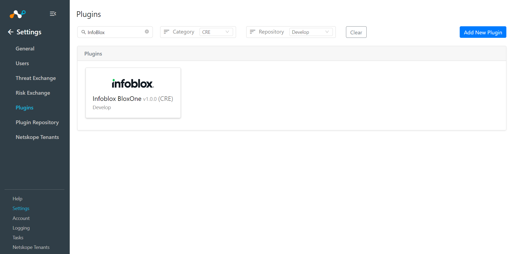
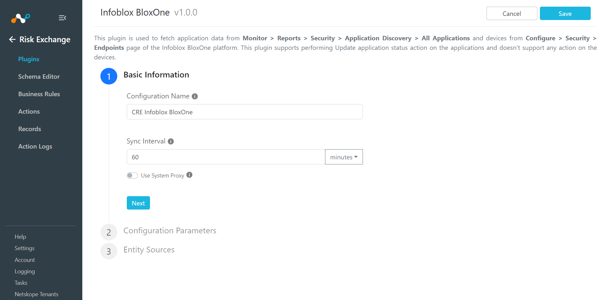
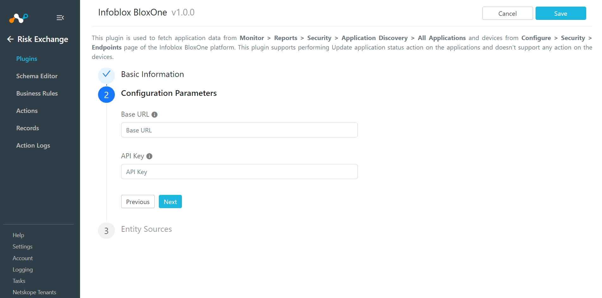
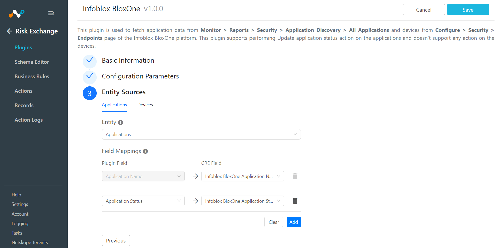
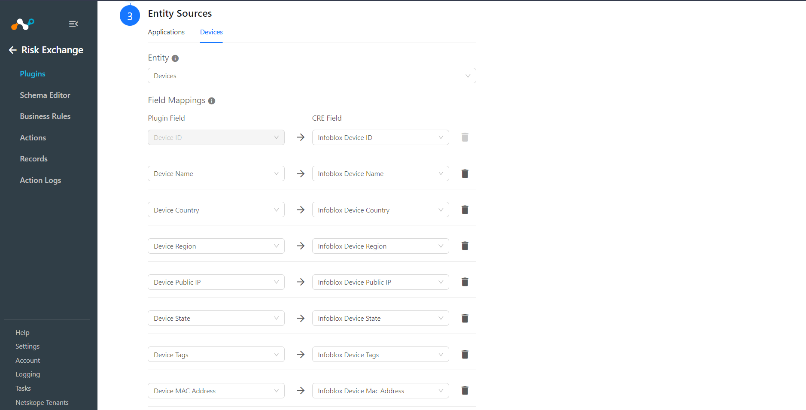
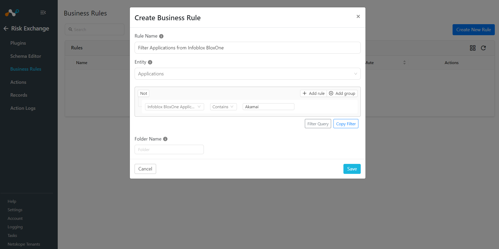
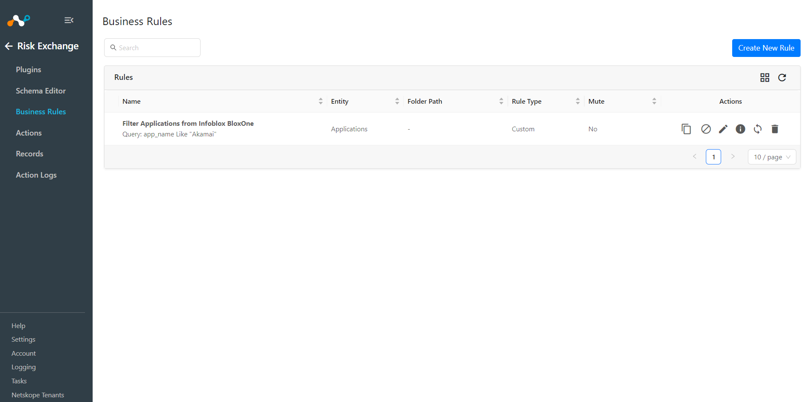

# CRE Infoblox BloxOne v1.0.0 README

## Release Notes
### 1.0.0
#### Added

- Initial Release.
- This plugin is used to fetch applications data from **Monitor > Reports > Security > Application Discovery > All Applications** and devices from **Configure > Security > Endpoints** page of the Infoblox BloxOne platform. This plugin supports performing Update application status action on the applications and doesn't support any action on the devices.

## Description

This plugin is used to fetch applications data from **Monitor > Reports > Security > Application Discovery > All Applications** and devices from **Configure > Security > Endpoints** page of the Infoblox BloxOne platform. This plugin supports performing Update application status action on the applications and doesn't support any action on the devices.

## CE Version Compatibility
- Netskope CE v5.1.0

## Plugin Scope

| Type of data supported        |    |                                     
|-------------------------------|------------------------------------------------------|
| Type of data pulled| Applications, Devices|
| Actions Supported| **Applications:** <br> - Update application status <br> - No Action <br> **Devices:** <br> - No actions|


## Prerequisites

- Netskope Cloud Exchange: CRE module
- Infoblox BloxOne URL and API Key

## Connectivity to the following hosts

- Connectivity to Infoblox BloxOne platform
## Mappings
The below mapping can be used to pull the Applications and Devices and their respective details. Mapped fields during plugin configuration will be visible on the Records page once the data is pulled. Below is the suggested mapping that should be used while configuring the plugin.

### Pull Mapping
#### Pull Mapping for Application
|Plugin Field    | Expected Datatype   | Suggested Field Name     | Suggested Field action |
|----------------------|--------|-------------------------------|------------|
| Application Name      | String | Infoblox Application Name     | Unique     |
| Application Status    | String | Infoblox Application Status   | Overwrite  |

#### Pull Mapping for Devices
|Plugin Field    | Expected Datatype   | Suggested Field Name     | Suggested Field action |
|----------------------|--------|-------------------------------|------------|
| Device ID           | String | Infoblox Device ID        | Unique     |
| Device Name         | String | Infoblox Device Name      | Overwrite  |
| Device Country      | String | Infoblox Device Country   | Overwrite  |
| Device Region       | String | Infoblox Device Region    | Overwrite  |
| Device Public IP    | String | Infoblox Device Public IP | Overwrite  |
| Device State        | String | Infoblox Device State     | Overwrite  |
| Device Tags         | List   | Infoblox Device Tags      | Overwrite  |
| Device MAC Address  | List   | Infoblox Device MAC Address | Overwrite  |


## API Details

### List of APIs used

| API Endpoint                  | Method | Use Case                   |
|-------------------------------|--------|----------------------------|
| /api/atcfw/v1/app_approvals    | GET    | Fetch Applications          |
| /api/atcep/v1/roaming_devices  | GET    | Fetch Devices               |
| /api/atcfw/v1/app_approvals    | PATCH  | Update Application Status   |


### Fetch Applications

**Endpoint:** <Base URL>/api/atcfw/v1/app_approvals

**Method:** GET

**Headers:**

| Key           | Value                                                |
|---------------|------------------------------------------------------|
| User-Agent    | netskope-ce-5.1.0-cre-infoblox-bloxone-v1.0.0        |
| Authorization | Token `<api_key>`                                    |

#### Sample API Response(Status Code 200):
```
{
  "results": [
    {
      "app_name": "<Application Name>",
      "status": "<APPROVED or UNAPPROVED>"
    }
  ]
}

```

### Fetch Devices

**Endpoint:** <Base URL>/api/atcep/v1/roaming_devices

**Method:** GET


**Parameters:**

|Key| Value|
|----|-------------------------|
| _limit| 10000 |
| _offset | 0 |


**Headers:**

| Key           | Value                                                |
|---------------|------------------------------------------------------|
| User-Agent    | netskope-ce-5.1.0-cre-infoblox-bloxone-v1.0.0        |
| Authorization | Token `<api_key>`                                    |

#### Sample API Response(Status Code 200):
```
{"results":[{"calculated_status":"ACTIVE","city_name":"san francisco","client_id":"b1a011e8328f75e7233db3c2a6d9c217","connected_time":"2024-09-12T05:34:19.398Z","country_name":"united states","created_time":"2024-09-12T05:34:19.398Z","device_info":"S-1-5-21-804185182-4086767973-266869295","device_region":"california","elb_ip_list":["string"],"group_id":53212,"group_name":"endpoint_group_a","is_uploading_logs":false,"log_level":"INFO","name":"endpoint_device_a","net_info":{"fqdn":"example1.corp-device.com","ipv4_addr_list":["10.5.77.12","11.2.5.39"],"mac_addr":["00:a0:c9:14:c8:29","12:cb:c0:31:ff:ee"],"state":{"protection":"UNKNOWN_SUB_STATUS","upgrade":"NO_OPERATION"}},"os_platform":"Windows 7 Enterprise","public_ip":"string","region":"ap-northeast-1","region_name":"Asia Pacific (Seoul)","serial_number":"string","tags":{},"updated_time":"2024-09-12T05:34:19.398Z","user_id":"user_a","user_id_verified":true,"version":"1.5.2"}],"total_result_count":0}
```
### Update Application Status

**Endpoint:** <Base URL>/api/atcfw/v1/app_approvals

**Method:** PATCH

**Headers:**

| Key           | Value                                                |
|---------------|------------------------------------------------------|
| User-Agent    | netskope-ce-5.1.0-cre-infoblox-bloxone-v1.0.0        |
| Authorization | Token `<api_key>`                                    |

#### Body:
```
{
    "inserted_approvals": [
        {
            "app_name": "<Application Name>",
            "status": "<APPROVED or UNAPPROVED>"
        }
    ]
}
```
#### Sample API Response(Status Code 200):
```
{
  "results": [
    {
      "app_name": "<Application Name>",
      "status": "<APPROVED or UNAPPROVED>"
    }
  ]
}
```


## User Agent

- netskope-ce-5.1.0-cre-infoblox-bloxone-v1.0.0

## Workflow

- Configure CRE Infoblox BloxOne plugin
- Add Business Rule
- Add Actions
- Validation


## Configuration on Netskope CE

### Infoblox BloxOne Plugin configuration
- Login to your Netskope CE and navigate to Settings > Plugins. Search for the CRE Infoblox BloxOne plugin and click on the plugin box to configure the plugin.



- Add plugin configuration name and change sync interval if needed. Click on Next.



- Click on the Next button and Add: Base URL and API Key.
  


- Click on Next. Select the Entity from the “Entity” dropdown, and Provide the field mapping as per the need.
  
**Note:** Application Name will be required to pull applications and to perform action on the pulled applications.



**Note:** Device ID field will be required to pull the Devices.



- Click on Save to Save the plugin.


### Add Business Rule

- Navigate to the Cloud Risk Exchange Module > Business Rule.
- Click on Create New Rule in the top right corner.
- Enter the Rule Name. Select the Entity in which Fields have been configured for the Infoblox BloxOne plugin,  and configure the query based on your requirements. The below example fetches Applications containing “Akamai” in Application Name. 
  


- Click on Save.



### Add Actions

### CRE InfoBlox BloxOne supports the following actions:
- Update Application Status

	* Update Application Status will update the status of application.
  
- No Action

	* No action will be performed for this action. Users can generate alerts in CTO by using this action and enabling the generate alerts toggle button.

### Update Application Status
- Go to Cloud Risk Exchange > Actions > Click on Add Action Configuration.
- Select the required Business Rule, Configuration, and Action from their respective dropdown.
- Enable the “Require Approval” radio button if Approval is needed before performing action on the Applications.
- Click on Save.

**Note :** Providing an Application name that doesn't exist in the Infoblox BloxOne platform will create a new application with the given static name or one retrieved from a dynamic source.

### No Action
- Go to Actions from Cloud Risk Exchange. Click on the Add Action Configuration button.
- Select Business rule, Configuration and choose the name of your configured plugin.
- Select Actions from the drop-down, and you can choose (No actions), enable the “Generate Alert” toggle button to generate alerts in the CTO module.
- Enable the “Require Approval” radio button if Approval is needed before performing action on the Devices.
- Click on Save.


## Troubleshooting

## Unable to Pull Data

#### If you are unable to pull Devices and Applications from the CRE Infoblox BloxOne plugin, it could be due to one of the below-mentioned reasons.
- No Devices or Applications present on the platform.
- An error is received while pulling Devices and Applications from the platform.
- Mapping is not added while configuring the plugin in the entity source page.

#### To resolve the above mentioned issues, follow the steps mentioned below.
- Check on the InfoBlox BloxOne platform if Devices or Applications exist or not.
- Receiving 500 error: The server might be down, wait for a while and check later.
- Receiving 401 error: The API Key provided in plugin configuration parameter is invalid or expired. 
- Make sure that the mapping is added and the "Device ID" field is mapped for Device entity and "Application Name" is mapped for Application entity while configuring the plugin.

## Unable to View Devices or Applications details on the Records Page

#### If you are unable to view Devices and Applications details on the record table, it could be due to one of the below-mentioned reasons.
- Mapping for all the Infoblox BloxOne fields is not provided while configuring the CRE Infoblox BloxOne plugin.
- Pulled Devices or Applications are displayed in a row with comma separated values.

#### To resolve the above mentioned issues, follow the steps mentioned below.
- Make sure to provide the needed mapping while configuring the plugin.
- Make sure that the fields created in an entity are according to the [Mapping](#mappings).