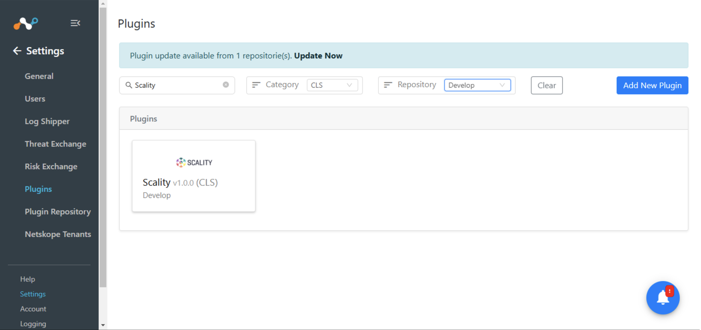
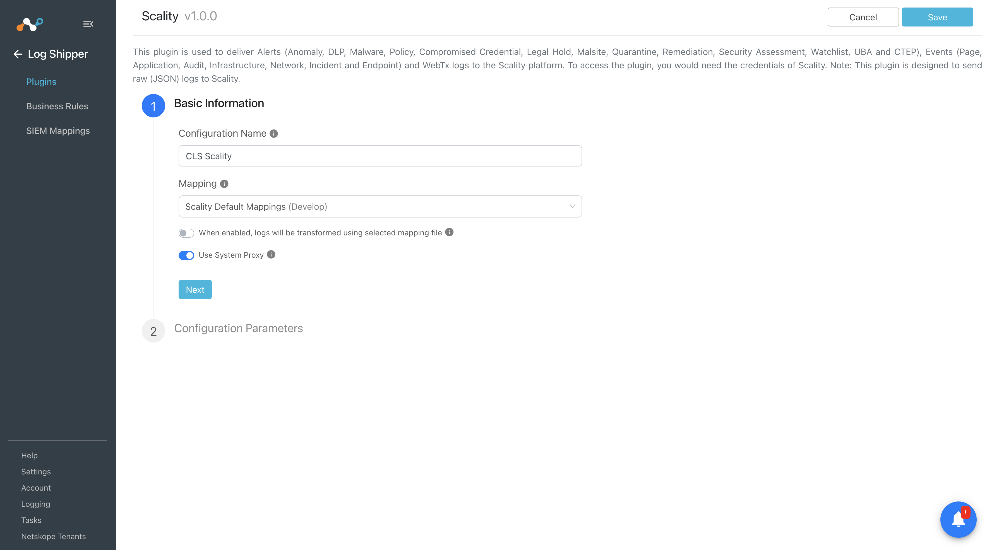
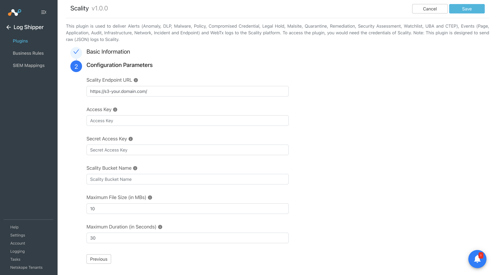
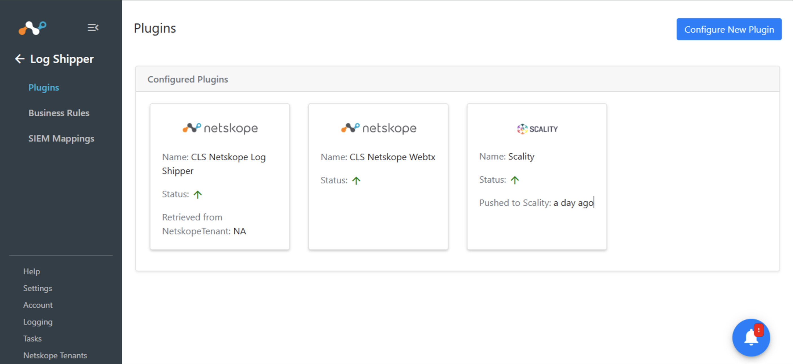
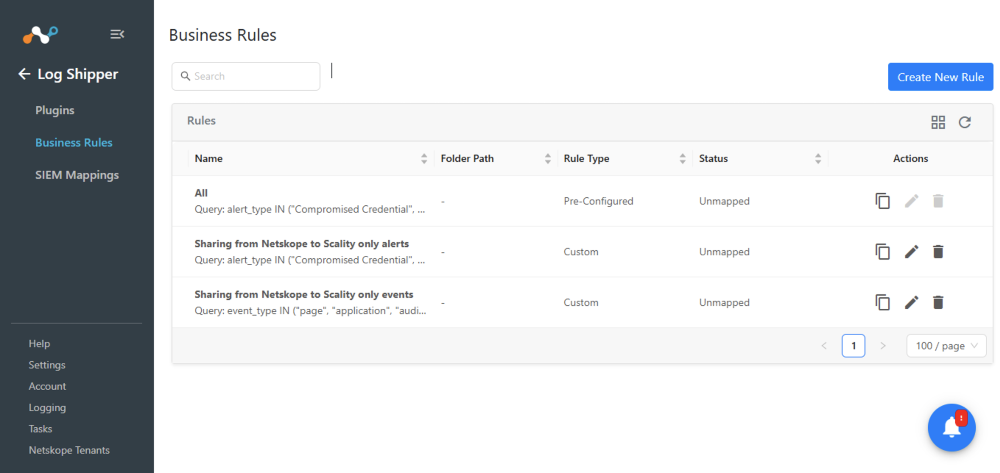
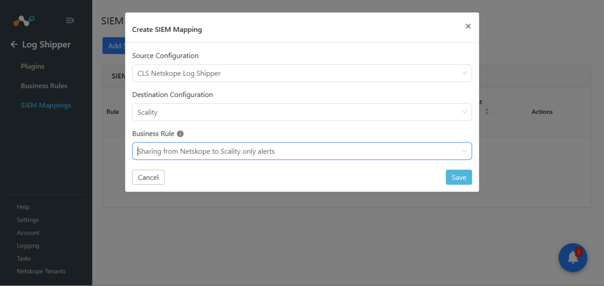
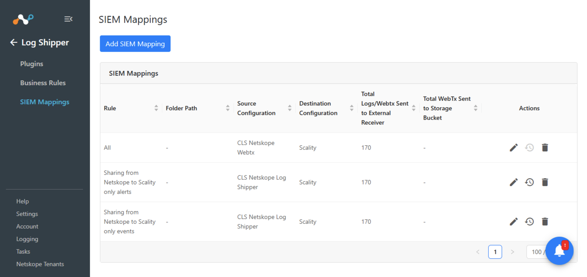
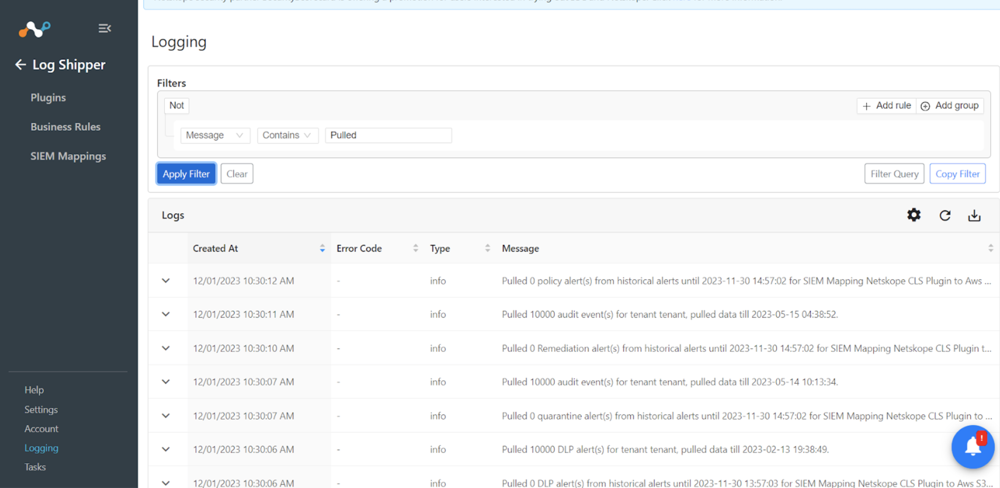
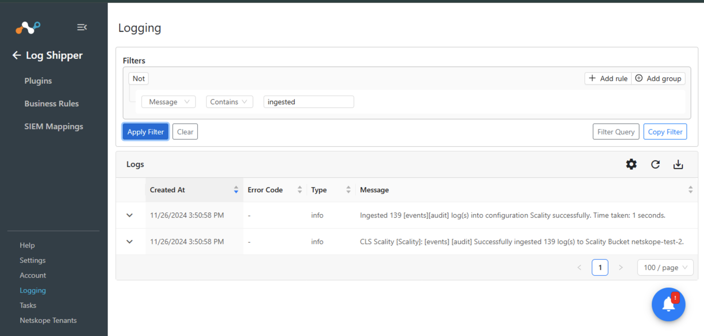

# CLS Scality v1.0.0 README

## Release Notes
### 1.0.0
#### Added

- Initial Release.

## Description

This plugin is used to deliver Alerts (Anomaly, DLP, Malware, Policy, Compromised Credential, Legal Hold, Malsite, Quarantine, Remediation, Security Assessment, Watchlist, UBA and CTEP), Events (Page, Application, Audit, Infrastructure, Network, Incident and Endpoint) and WebTx logs to the Scality platform. To access the plugin, you would need the credentials of Scality. Note: This plugin is designed to send raw (JSON) logs to Scality.


## CE Version Compatibility
- Netskope CE v5.0.1, v5.1.0

## Plugin Scope

### Type of data supported 

|  |    |                                     
|-------------------------------|------------------------------------------------------|
| Event Types | Yes (Page, Application, Audit, Infrastructure, Network, Incident and Endpoint)|
| Alert Types | Yes (Anomaly, DLP, Malware, Policy, Compromised Credential, Legal Hold, Malsite, Quarantine, Remediation, Security Assessment, Watchlist, UBA and CTEP)|
| WebTx Support | Yes|


## Prerequisites

- Netskope Tenant
- Netskope Cloud Exchange: CLS module
- Access to Scality Instance with Instance URL, Bucket Name and Access Key and Secret Access Key. 

## Connectivity to the following hosts

- Connectivity to Scality platform

## Mappings
- NA

## API Details

### List of APIs used

| API Endpoint                  | Method | Use Case                   |
|-------------------------------|--------|----------------------------|
| AWS SDK for Python (Boto3)    | SDK    |  Ingest Alerts, Events and WebTx data        |


- Usage: The AWS SDK for Python (Boto3) to create, configure, and manage AWS services, such as Amazon Elastic Compute Cloud (Amazon EC2) and Amazon Simple Storage Service (Amazon S3). The SDK provides an object-oriented API as well as low-level access to AWS services.

#### Creating the Client: 

```bash
s3_client = boto3.client("s3",
    aws_access_key_id=self.scality_public_key,
    aws_secret_access_key=self.scality_private_key,
    aws_session_token=self.scality_session_token,
    endpoint_url=endpoint_url
    config=Config(proxies=self.proxy, user_agent=self.useragent),
)
```

#### Creating Bucket : 
```bash
bucket = s3_client.create_bucket(
    Bucket=bucket_name,
    CreateBucketConfiguration=location,
)
```

#### Upload File into the Bucket: 
```bash
 s3_client.upload_file(
    file_name,
    bucket_name,
    object_name,
)
```

#### Get AWS Resource: 
```bash
s3_resource = boto3.resource("s3",
    aws_access_key_id=self.scality_public_key,
    aws_secret_access_key=self.scality_private_key,
    endpoint_url=endpoint_url
    config=Config(proxies=self.proxy, user_agent=self.user-agent),
)
```

## Workflow

- Configure Netskope Tenant
- Configure Netskope CLS Plugin
- Configure Netskope WebTx Plugin
- Configure Scality plugin
- Add Business Rules
- Add SIEM Mapping
- Validate the plugin


## Configuration on Netskope CE

### Configuration on Netskope Tenant

#### Configuring the Netskope Tenant 
- Follow the steps provided in the below document to configure the Netskope Tenant

https://docs.netskope.com/en/netskope-help/integrations-439794/netskope-cloud-exchange/get-started-with-cloud-exchange/configure-netskope-tenants/

#### Configuring the Netskope CLS plugin
- Follow the below steps to configure the Netskope CLS plugin in Netskope CE

https://docs.netskope.com/en/netskope-help/integrations-439794/netskope-cloud-exchange/get-started-with-cloud-exchange/configure-the-netskope-plugin-for-log-shipper/

#### Configuring the Netskope WebTx plugin
- Follow the steps provided in the below document to configure the Netskope WebTx Plugin

https://docs.netskope.com/en/netskope-help/integrations-439794/netskope-cloud-exchange/log-shipper-module/configure-3rd-party-log-shipper-plugins/webtx-plugin-for-log-shipper/

### Scality Plugin configuration
- Login to your Netskope CE and navigate to Settings > Plugins. Search for the CLS Scality plugin and click on the plugin box to configure the plugin.



- Add plugin configuration name.
#### Note : Keep "use mapping file" toggle disabled.



#### Click on the Next button and add below parameters
- **Scality Endpoint URL:** Endpoint URL of the Scality instance. Eg - https://s3-your.domain.com/
- **Access Key:** Access Key for the Scality instance.
- **Secret Access Key:** Secret Access Key for the Scality instance.
- **Scality Bucket Name:** Scality Bucket Name in which the logs object will be stored. (Bucket will not be created if the bucket with the specified name does not exist on Scality.)
- **Maximum File Size (in MBs):** Maximum size of WebTx data object to be stored in the bucket. (Value should be between 1 to 100). Note: This field will only be used for WebTx logs.
- **Maximum Duration (in Seconds):** Maximum duration after which the WebTx data object should be stored in the bucket. Note: This field will only be used for WebTx logs.
  


- Click on the Save button to save the configuration. Plugin configuration will be available on the Cloud Log Shipper > Plugins page.




### Add Business Rule

- Go to the Business Rule page. 
- By default, we have a business rule that filters all alerts and events. If you want to filter out any specific type of alert or event click on ‘Create New Rule’ and configure a new business rule by adding the rule name and filter.


- Click on Save.



### Add SIEM Mapping

- Go to the SIEM Mapping page and click on Add SIEM Mapping page. 
- Select the Source plugin(Netskope CLS, Netskope WebTx), Destination plugin(CLS Scality), select business rule and click on save.
- Once the SIEM mapping is added the data will start to be pulled from the Netskope tenant, transformed, and ingested into Scality





## Validation on Netskope CE

### Validate the Pull
- To validate the pulling of indicators from the Netskope tenant.
Go to the Logging in Netskope CE. Search for the pulled logs.



### Validate the Push
#### To validate the plugin workflow, on Netskope Cloud Exchange.
- Go to Logging and Search for ingested events with the filter “message contains ingested”. 
- The ingested logs will be filtered.

